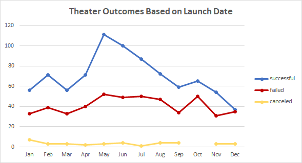
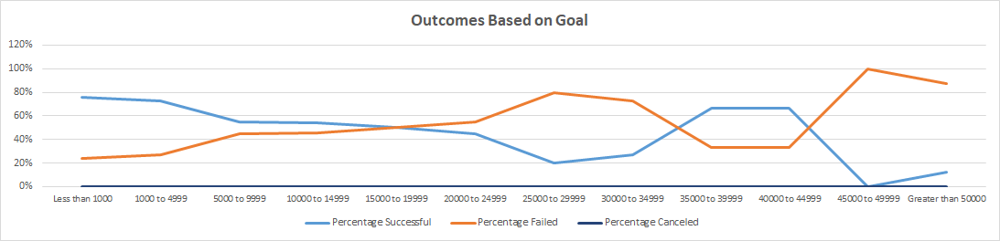

# Kickstarting with Excel

## Overview of Project

### Purpose
Analyse crowdfunding data from Kickstarter to determine how different theater campaigns performed in relation to their launch dates and their funding goals. These insights will help Louise to set her first crownfunding campaign to fund her play "Fever" with an estimated budget of over 10,000 dollars.

## Analysis and Challenges

### Analysis of Outcomes Based on Launch Date
Based on the analysis of all the theater campaigns on Kickstarter, May was the month that had the most successful theater campaigns and December had the least. 

### Analysis of Outcomes Based on Goals
Louise is estimating a budget of over 10,000 dollars. Based on the analysis of campaigns on Kickstarter, 54% of the play campaigns with a goal between 10,000 and 14,999 dollars were successful, 46% failed and none were canceled. The highest successful rates are for play campaigns with a goal below 4,999 dollars.

### Challenges and Difficulties Encountered
This is a small dataset and a better understanding of the theater crowdfunding scenario would benefit from having more information available and creating additional analysis, including a histogram.

## Results
The best month to launch a campaign is May and the worst month is December.

Campaigns with a goal between 10,000 and 14,999 dollars had more success than failure, however, a goal below 4,999 dollars will be more easily achieved.

A larger dataset would allow for a more profound analysis. For a more detailed recommendation, an analysis using statistical components would be preferred. It is recommended to use measures of Central Tendency to determine the distribution and find outliers.
